# ⚡ EmailAI — Intelligent AI Email Client & Career Opportunity Agent

> A full-featured, AI-powered email management platform featuring sub-second AI email drafting, automatic career/internship opportunity detection, trust & scam verification, deadline reminders, and an interactive analytics suite.

<div align="center">

[](https://react.dev/)
[](https://nodejs.org/)
[](https://supabase.com/)
[-76B900?logo=nvidia&logoColor=white&style=for-the-badge)](https://integrate.api.nvidia.com/)
[](https://agenticemail-pdkn.vercel.app)
[](https://emailai-backend-gr8m.onrender.com)

</div>

---

## 🌐 Live Deployments & Demo Video

* 🚀 **Live Web Application (Vercel)**: [https://agenticemail-pdkn.vercel.app](https://agenticemail-pdkn.vercel.app)
* ⚙️ **Production API Gateway (Render)**: [https://emailai-backend-gr8m.onrender.com](https://emailai-backend-gr8m.onrender.com)
* 📖 **Interactive Swagger API Docs**: [https://emailai-backend-gr8m.onrender.com/api/docs](https://emailai-backend-gr8m.onrender.com/api/docs)
* 🩺 **Backend Health Endpoint**: [https://emailai-backend-gr8m.onrender.com/api/health](https://emailai-backend-gr8m.onrender.com/api/health)

### 🎥 Live Video Walkthrough
[](YOUR_VIDEO_LINK_HERE)

> *Replace `YOUR_VIDEO_LINK_HERE` with your YouTube or Loom video walkthrough link.*

---

## 📸 Screenshots & UI Showcase

[](https://drive.google.com/drive/folders/1-QXVNR0at_n_RpyvkaBqGRZ4WDx9m11x?usp=sharing)

📂 **Google Drive Folder**: [Click here to view all full-resolution screenshots](https://drive.google.com/drive/folders/1-QXVNR0at_n_RpyvkaBqGRZ4WDx9m11x?usp=sharing)

<div align="center">

### 1. 🔐 Authentication & Login
[](https://drive.google.com/drive/folders/1-QXVNR0at_n_RpyvkaBqGRZ4WDx9m11x?usp=sharing)

---

### 2. 📬 Modern Inbox & Real-Time Dashboard
[](https://drive.google.com/drive/folders/1-QXVNR0at_n_RpyvkaBqGRZ4WDx9m11x?usp=sharing)

---

### 3. ✍️ AI Compose Assistant & Tone Customizer
[](https://drive.google.com/drive/folders/1-QXVNR0at_n_RpyvkaBqGRZ4WDx9m11x?usp=sharing)

---

### 4. 🛡️ Career Opportunities & Scam Verifier
[](https://drive.google.com/drive/folders/1-QXVNR0at_n_RpyvkaBqGRZ4WDx9m11x?usp=sharing)

</div>

---

## 🏛️ System Architecture & Deployment Topology

### Production Deployment Topology
```
                 👤 USER / BROWSER
                         │
                         ▼
              ┌─────────────────────┐
              │       VERCEL        │
              │  Frontend React App │
              │  (Vite Single Page) │
              └──────────┬──────────┘
                         │
                         │ 📡 REST API & WebSockets
                         ▼
              ┌─────────────────────┐
              │       RENDER        │
              │  Backend API Server │
              │  (Node.js / Express)│
              └──────────┬──────────┘
                         │
            ┌────────────┴────────────┐
            │ SQL Queries             │ LLM Inference (~1.0s)
            ▼                         ▼
  ┌─────────────────────┐   ┌─────────────────────┐
  │      SUPABASE       │   │     NVIDIA NIM      │
  │     PostgreSQL      │   │   Meta Llama 3.2    │
  │ Relational Database │   │  11B Vision Instruct│
  └─────────────────────┘   └─────────────────────┘
```

### Continuous Deployment (CI/CD) Pipeline
```
                    ┌─────────────────────────┐
                    │    GitHub Repository    │
                    │ (Mohilc/agenticemail)   │
                    └────────────┬────────────┘
                                 │
                   ┌─────────────┴─────────────┐
                   │ Auto-Trigger on git push  │
                   ▼                           ▼
         ┌───────────────────┐       ┌───────────────────┐
         │      VERCEL       │       │      RENDER       │
         │  Frontend Build   │       │   Backend Build   │
         │  (Vite Production)│       │  (Node.js Server) │
         └─────────┬─────────┘       └─────────┬─────────┘
                   │                           │
                   │ API Requests              │ Database Sync
                   └──────────────────────────>│
                                               ▼
                                     ┌───────────────────┐
                                     │     SUPABASE      │
                                     │  PostgreSQL Cloud │
                                     └───────────────────┘
```

---

## 🔄 Detailed Request Lifecycle & Flow

```mermaid
flowchart TD
    %% Styling Definitions
    classDef clientStyle fill:#1e293b,stroke:#6366f1,stroke-width:2px,color:#ffffff;
    classDef backendStyle fill:#0f172a,stroke:#22c55e,stroke-width:2px,color:#ffffff;
    classDef aiStyle fill:#1e1e38,stroke:#f59e0b,stroke-width:2px,color:#ffffff;
    classDef dbStyle fill:#111827,stroke:#38bdf8,stroke-width:2px,color:#ffffff;

    subgraph CLIENT ["🖥️ FRONTEND CLIENT (React 18 + Vite on Vercel)"]
        UI["🎨 Modern UI & Glassmorphism Components"]
        COMPOSER["✍️ AI Email Composer & Tone Picker"]
        OPP_DASH["💼 Career Tracker & Deadline Countdown"]
        SOCKET_C["⚡ Socket.io Real-time Client"]
    end
    class CLIENT,UI,COMPOSER,OPP_DASH,SOCKET_C clientStyle;

    subgraph BACKEND ["⚙️ BACKEND API LAYER (Node.js + Express on Render)"]
        API["📡 REST API Gateways (/api/*)"]
        AUTH_MW["🔒 JWT Auth & Security Middleware"]
        CRON["⏰ Background Cron Scheduler"]
        SOCKET_S["🔔 Socket.io Push Server"]
        OPP_CONTROLLER["🛡️ Opportunity & Fraud Controller"]
    end
    class BACKEND,API,AUTH_MW,CRON,SOCKET_S,OPP_CONTROLLER backendStyle;

    subgraph AI_ENGINE ["🤖 AI INTELLIGENCE LAYER (NVIDIA NIM)"]
        LLM["⚡ Meta Llama 3.2 11B (~1.0s)"]
        PROMPT_ENG["🎯 Prompt Engineering & Tone Customizer"]
        FRAUD_SCAN["🛡️ Authenticity, Scam & Deadline Extractor"]
        COVER_LETTER["✨ 1-Click AI Cover Letter Generator"]
    end
    class AI_ENGINE,LLM,PROMPT_ENG,FRAUD_SCAN,COVER_LETTER aiStyle;

    subgraph DATABASE ["🗄️ PERSISTENCE LAYER (Supabase PostgreSQL)"]
        USERS_TB[("👤 users\n(Auth & Profiles)")]
        EMAILS_TB[("📬 emails & recipients\n(Threads & Folders)")]
        OPPS_TB[("💼 job_opportunities\n(Trust Scores & Deadlines)")]
        LABELS_TB[("🏷️ labels\n(Custom Color Tags)")]
    end
    class DATABASE,USERS_TB,EMAILS_TB,OPPS_TB,LABELS_TB dbStyle;

    %% Data Connections
    UI <== "1. User Actions & REST Queries" ==> API
    COMPOSER -- "2. Trigger AI Drafter" --> API
    OPP_DASH -- "3. Scan Opportunities & Set Alerts" --> OPP_CONTROLLER
    API <== "4. Verify Tokens" ==> AUTH_MW
    API <== "5. Read / Write Data" ==> DATABASE
    OPP_CONTROLLER -- "6. Fast NIM Inference" --> LLM
    API -- "7. Smart Replies / Summaries" --> LLM
    LLM --> PROMPT_ENG
    LLM --> FRAUD_SCAN
    LLM --> COVER_LETTER
    CRON -- "8. Scheduled Emails & Alerts" --> EMAILS_TB
    CRON -- "9. Push Instant Alerts" --> SOCKET_S
    SOCKET_S <== "10. Real-Time WebSockets" ==> SOCKET_C
```



---

## 🚀 Key Features Breakdown

### 1. 🤖 AI Writing Assistant (Sub-Second Latency)
* **AI Email Drafter**: Generate full, context-rich emails from quick prompts with selectable tones (*Professional, Friendly, Urgent, Persuasive*).
* **Smart Replies**: Suggests 3 context-aware, 1-click reply options tailored to the incoming message.
* **Smart Subject Generator**: Automatically drafts high-open-rate subject lines based on your draft content.
* **Email Summarizer**: Condenses long threads and newsletters into key bullet points.
* **Sentiment Analysis**: Evaluates customer and colleague sentiment (*Positive, Neutral, Negative*).

### 2. 🛡️ AI Job & Internship Opportunity Detector & Verification Agent
* **Automated Opportunity Detection**: Scans incoming emails for career openings, internships, and fellowships.
* **Trust & Scam Verification**: Evaluates employer legitimacy, domain integrity, and flags potential scams (e.g. upfront fee requests) with a **0–100% Trust Score**.
* **Deadline Tracking & Countdown**: Extracts application closing dates and displays dynamic countdown badges (`🚨 Closes Today`, `⏳ 2 days left`).
* **Deadline Reminders**: 1-click toggle for email deadline alerts.
* **1-Click AI Application Drafter**: Generates tailored, high-converting cover letters and applications for any position.

### 3. 📬 Complete Modern Email Client
* **Folder Management**: Inbox, Sent, Drafts, Starred, Archive, Trash, and Spam.
* **Real-time Delivery**: Instant updates powered by WebSockets (Socket.io) without page refreshes.
* **Auto-Contact Resolution**: Automatically detects and creates external recipient contacts when sending emails.
* **Custom Color Labels & Categorization**: Categorize messages into *Primary, Updates, Promotions, and Social*.
* **Scheduled Sending**: Schedule emails to be sent automatically at future timestamps.

### 4. 📊 Analytics & Activity Dashboard
* Tracks sent/received volume, weekly activity timelines, category distributions, and sentiment breakdowns.

---

## 🚀 Complete Setup & Deployment Guide

### Phase 1: Supabase Database Setup

1. Create a free account at **[supabase.com](https://supabase.com)** and create a new project named **`EmailAI`**.
2. Go to the **SQL Editor** tab in your Supabase project dashboard.
3. Open [`supabase/migrations/20260827_schema.sql`](./supabase/migrations/20260827_schema.sql) from this repository, paste the SQL code into the editor, and click **Run**.
4. Go to **Project Settings** (gear icon at bottom left) -> **API**.
5. Copy your **Project URL** and the **`service_role` secret key** (starts with `ey...`).

---

### Phase 2: Deploy Backend to Render

1. Create an account at **[render.com](https://render.com/)** and link your GitHub account.
2. Click **New +** -> **Web Service**.
3. Select your repository: **`Mohilc/agenticemail`**.
4. Configure the service settings:
   * **Name**: `emailai-backend`
   * **Root Directory**: `backend`
   * **Runtime**: `Node`
   * **Build Command**: `npm install`
   * **Start Command**: `node server.js`
5. Click **Advanced** -> **Add Environment Variable** and add:

| Key | Example / Recommended Value |
|---|---|
| `PORT` | `10000` |
| `NODE_ENV` | `production` |
| `JWT_SECRET` | `emailai_secure_jwt_secret_2026` |
| `JWT_REFRESH_SECRET` | `emailai_secure_jwt_refresh_secret_2026` |
| `OPENAI_API_KEY` | *(Your NVIDIA NIM API key starting with `nvapi-...`)* |
| `OPENAI_BASE_URL` | `https://integrate.api.nvidia.com/v1` |
| `AI_MODEL` | `meta/llama-3.2-11b-vision-instruct` |
| `SUPABASE_URL` | `https://your-project.supabase.co` |
| `SUPABASE_KEY` | *(Your Supabase `service_role` secret key)* |
| `CLIENT_URL` | `https://agenticemail-pdkn.vercel.app` |

6. Click **Create Web Service**. Render will build and deploy your backend server with a live URL (e.g. `https://emailai-backend-gr8m.onrender.com`).

---

### Phase 3: Deploy Frontend to Vercel

1. Create an account at **[vercel.com](https://vercel.com/)** and import your GitHub repository: **`Mohilc/agenticemail`**.
2. Configure the project settings:
   * **Framework Preset**: `Vite`
   * **Root Directory**: `frontend`
   * **Build Command**: `npm run build`
   * **Output Directory**: `dist`
   * **Install Command**: `npm install`
3. Expand **Environment Variables** and add:

| Key | Value |
|---|---|
| `VITE_API_URL` | `https://emailai-backend-gr8m.onrender.com/api` |

4. Click **Deploy**. Vercel will build and provide your live frontend URL (e.g. `https://agenticemail-pdkn.vercel.app`).

---

### Phase 4: Local Development Setup

```bash
# 1. Clone the repository
git clone https://github.com/Mohilc/agenticemail.git
cd agenticemail

# 2. Install all dependencies
npm install
cd backend && npm install
cd ../frontend && npm install

# 3. Create backend/.env file and fill in your keys
# 4. Start local development server (Frontend + Backend)
npm run dev
```

* **Frontend**: `http://localhost:5173`
* **Backend API**: `http://localhost:5000/api`

---

## 📡 REST API Endpoints Reference

| Method | Endpoint | Description | Auth Required |
|---|---|---|:---:|
| `POST` | `/api/auth/signup` | Register a new user account | ❌ |
| `POST` | `/api/auth/login` | Authenticate user & issue JWT tokens | ❌ |
| `GET` | `/api/emails/:folder` | Fetch emails by folder (inbox, sent, drafts, trash, spam) | ✅ |
| `POST` | `/api/emails` | Compose, send, or schedule an email | ✅ |
| `PATCH` | `/api/emails/:id` | Update email flags (read, star, labels, trash) | ✅ |
| `DELETE`| `/api/emails/:id` | Permanently delete an email | ✅ |
| `POST` | `/api/ai/compose` | AI email drafter with tone selection | ✅ |
| `POST` | `/api/ai/smart-reply` | Generate 3 contextual 1-click replies | ✅ |
| `POST` | `/api/ai/summarize` | Summarize long email threads | ✅ |
| `GET` | `/api/opportunities` | List detected job & internship opportunities | ✅ |
| `POST` | `/api/opportunities/analyze/:emailId` | Run AI opportunity & fraud scan on email | ✅ |
| `POST` | `/api/opportunities/:id/draft` | 1-Click AI cover letter & pitch generator | ✅ |
| `GET` | `/api/analytics` | Fetch email traffic, peak hours, and sentiment stats | ✅ |

---

## 📄 License
This project is open-source under the [MIT License](LICENSE).
