# ⚡ EmailAI — Intelligent AI Email Client & Career Opportunity Agent

> A full-featured, AI-powered email management platform featuring sub-second AI email drafting, automatic career/internship opportunity detection, trust & scam verification, deadline reminders, and an interactive analytics suite.

[](https://react.dev/)
[](https://nodejs.org/)
[](https://supabase.com/)
[-76B900?logo=nvidia&logoColor=white)](https://integrate.api.nvidia.com/)
[](https://agenticemail-pdkn.vercel.app)
[](https://emailai-backend-gr8m.onrender.com)

---

## 🌐 Live Deployments & Demo Video

* 🚀 **Live Web App (Vercel)**: [https://agenticemail-pdkn.vercel.app](https://agenticemail-pdkn.vercel.app)
* ⚙️ **Backend API Server (Render)**: [https://emailai-backend-gr8m.onrender.com](https://emailai-backend-gr8m.onrender.com)
* 📖 **Interactive Swagger Docs**: [https://emailai-backend-gr8m.onrender.com/api/docs](https://emailai-backend-gr8m.onrender.com/api/docs)
* 🩺 **API Health Check**: [https://emailai-backend-gr8m.onrender.com/api/health](https://emailai-backend-gr8m.onrender.com/api/health)

### 🎥 Live Video Walkthrough
[](YOUR_VIDEO_LINK_HERE)

> *Replace `YOUR_VIDEO_LINK_HERE` with your YouTube, Loom, or Drive video walkthrough link.*

---

---

## 📸 Screenshots & UI Showcase

[](https://drive.google.com/drive/folders/1-QXVNR0at_n_RpyvkaBqGRZ4WDx9m11x?usp=sharing)

📂 **Direct Link**: [Google Drive Screenshots Folder](https://drive.google.com/drive/folders/1-QXVNR0at_n_RpyvkaBqGRZ4WDx9m11x?usp=sharing)

<div align="center">

### 1. 🔐 Authentication & Login
[](https://drive.google.com/drive/folders/1-QXVNR0at_n_RpyvkaBqGRZ4WDx9m11x?usp=sharing)

---

### 2. 📬 Modern Inbox & Real-Time Dashboard
[](https://drive.google.com/drive/folders/1-QXVNR0at_n_RpyvkaBqGRZ4WDx9m11x?usp=sharing)

---

### 3. ✍️ AI Compose Assistant & Tone Customizer
[](https://drive.google.com/drive/folders/1-QXVNR0at_n_RpyvkaBqGRZ4WDx9m11x?usp=sharing)

---

### 4. 🛡️ Career Opportunities & Scam Verifier
[](https://drive.google.com/drive/folders/1-QXVNR0at_n_RpyvkaBqGRZ4WDx9m11x?usp=sharing)

</div>

---

## 🏛️ System Architecture & Data Flow

```mermaid
flowchart TD
    %% Styling Definitions
    classDef clientStyle fill:#1e293b,stroke:#6366f1,stroke-width:2px,color:#ffffff;
    classDef backendStyle fill:#0f172a,stroke:#22c55e,stroke-width:2px,color:#ffffff;
    classDef aiStyle fill:#1e1e38,stroke:#f59e0b,stroke-width:2px,color:#ffffff;
    classDef dbStyle fill:#111827,stroke:#38bdf8,stroke-width:2px,color:#ffffff;
    classDef devopsStyle fill:#18181b,stroke:#a855f7,stroke-width:2px,color:#ffffff;

    subgraph CLIENT ["🖥️ FRONTEND CLIENT (React 18 + Vite on Vercel)"]
        UI["🎨 Modern UI & Glassmorphism Components"]
        COMPOSER["✍️ AI Email Composer & Tone Picker"]
        OPP_DASH["💼 Career Tracker & Deadline Countdown"]
        SOCKET_C["⚡ Socket.io Real-time Client"]
    end
    class CLIENT,UI,COMPOSER,OPP_DASH,SOCKET_C clientStyle;

    subgraph BACKEND ["⚙️ BACKEND API LAYER (Node.js + Express on Render)"]
        API["📡 REST API Gateways (/api/*)"]
        AUTH_MW["🔒 JWT Auth & Security Middleware"]
        CRON["⏰ Background Cron Scheduler (Emails & Deadlines)"]
        SOCKET_S["🔔 Socket.io Push Server"]
        OPP_CONTROLLER["🛡️ Opportunity & Fraud Controller"]
    end
    class BACKEND,API,AUTH_MW,CRON,SOCKET_S,OPP_CONTROLLER backendStyle;

    subgraph AI_ENGINE ["🤖 AI INTELLIGENCE LAYER (NVIDIA NIM)"]
        LLM["⚡ Meta Llama 3.2 11B Vision Instruct (~1.0s)"]
        PROMPT_ENG["🎯 Prompt Engineering & Tone Synthesis"]
        FRAUD_SCAN["🛡️ Authenticity, Scam & Deadline Extractor"]
        COVER_LETTER["✨ 1-Click AI Cover Letter Generator"]
    end
    class AI_ENGINE,LLM,PROMPT_ENG,FRAUD_SCAN,COVER_LETTER aiStyle;

    subgraph DATABASE ["🗄️ PERSISTENCE LAYER (Supabase PostgreSQL)"]
        USERS_TB[("👤 users\n(Auth, Profiles, Settings)")]
        EMAILS_TB[("📬 emails & recipients\n(Inbox, Sent, Starred, Threads)")]
        OPPS_TB[("💼 job_opportunities\n(Trust Scores, Deadlines, Reminders)")]
        LABELS_TB[("🏷️ labels & junctions\n(Custom Color Tags)")]
    end
    class DATABASE,USERS_TB,EMAILS_TB,OPPS_TB,LABELS_TB dbStyle;

    %% Data Connections & Flow
    UI <== "1. User Actions & REST Queries" ==> API
    COMPOSER -- "2. Trigger AI Drafter" --> API
    OPP_DASH -- "3. Scan Opportunities & Set Alerts" --> OPP_CONTROLLER

    API <== "4. Verify Tokens & Passwords" ==> AUTH_MW
    API <== "5. Read / Write Relational Data" ==> DATABASE

    OPP_CONTROLLER -- "6. Fast Inference Request" --> LLM
    API -- "7. Smart Replies / Summaries" --> LLM
    LLM --> PROMPT_ENG
    LLM --> FRAUD_SCAN
    LLM --> COVER_LETTER

    CRON -- "8. Dispatch Scheduled Emails" --> EMAILS_TB
    CRON -- "9. Push Instant Alerts" --> SOCKET_S
    SOCKET_S <== "10. Real-Time WebSocket Channel" ==> SOCKET_C
```



---

### 🔄 End-to-End Request Lifecycle

| Phase | Flow Description | Technologies Used |
|---|---|---|
| **1. Composition & AI Drafting** | The user inputs a prompt and chooses a tone (*Professional, Friendly, Urgent*). The backend sends structured system prompts to NVIDIA NIM, returning a formatted draft in **~1.0 second**. | React, Express, NVIDIA NIM (Llama 3.2) |
| **2. Career & Scam Detection** | Incoming emails are scanned for career keywords. The AI extracts the job title, company, deadline, and calculates a **0–100% Trust Score** by evaluating domain legitimacy and fraud signals. | Llama 3.2 AI, Regex Pipeline, Supabase |
| **3. Instant Real-Time Push** | When an email arrives or an application deadline triggers an alert, the backend pushes events instantly to active browser tabs without page refreshes. | WebSockets (Socket.io) |
| **4. Secure Data Persistence** | User passwords are encrypted with bcrypt. Relational email threads, label junctions, and opportunity deadlines are indexed in PostgreSQL for low-latency queries. | Supabase PostgreSQL, JWT, bcryptjs |

---

## 🚀 Core Features Breakdown

### 1. 🤖 AI Writing Assistant (Sub-Second Latency)
* **AI Email Drafter**: Generate full, context-rich emails from quick prompts with selectable tones (*Professional, Friendly, Urgent, Persuasive*).
* **Smart Replies**: Suggests 3 context-aware, 1-click reply options tailored to the incoming message.
* **Smart Subject Generator**: Automatically drafts high-open-rate subject lines based on your draft content.
* **Email Summarizer**: Condenses long threads and newsletters into key bullet points.
* **Sentiment Analysis**: Evaluates customer and colleague sentiment (*Positive, Neutral, Negative*).

### 2. 🛡️ AI Job & Internship Opportunity Detector & Verification Agent
* **Automated Opportunity Detection**: Scans incoming emails for career openings, internships, and fellowships.
* **Trust & Scam Verification**: Evaluates employer legitimacy, domain integrity, and flags potential scams (e.g. upfront fee requests) with a **0–100% Trust Score**.
* **Deadline Tracking & Countdown**: Extracts application closing dates and displays dynamic countdown badges (`🚨 Closes Today`, `⏳ 2 days left`).
* **Deadline Reminders**: 1-click toggle for email deadline alerts.
* **1-Click AI Application Drafter**: Generates tailored, high-converting cover letters and applications for any position.

### 3. 📬 Complete Modern Email Client
* **Folder Management**: Inbox, Sent, Drafts, Starred, Archive, Trash, and Spam.
* **Real-time Delivery**: Instant updates powered by WebSockets (Socket.io) without page refreshes.
* **Auto-Contact Resolution**: Automatically detects and creates external recipient contacts when sending emails.
* **Custom Color Labels & Categorization**: Categorize messages into *Primary, Updates, Promotions, and Social*.
* **Scheduled Sending**: Schedule emails to be sent automatically at future timestamps.

### 4. 📊 Analytics & Activity Dashboard
* Tracks sent/received volume, weekly activity timelines, category distributions, and sentiment breakdowns.

---

## 🛠️ Local Development Setup

### 1. Prerequisites
* **Node.js** v18+ installed
* A free **[Supabase](https://supabase.com)** project
* An **[NVIDIA NIM](https://build.nvidia.com)** API key

### 2. Clone the Repository
```bash
git clone https://github.com/Mohilc/agenticemail.git
cd agenticemail
```

### 3. Install Dependencies
```bash
# Install root dependencies
npm install

# Install backend dependencies
cd backend && npm install

# Install frontend dependencies
cd ../frontend && npm install
```

### 4. Configure Environment Variables

Create a `.env` file in the `backend/` directory:

```env
PORT=5000
NODE_ENV=development

# JWT Secrets
JWT_SECRET=your_jwt_secret_key_2026
JWT_REFRESH_SECRET=your_jwt_refresh_secret_key_2026
JWT_EXPIRE=15m
JWT_REFRESH_EXPIRE=7d

# NVIDIA NIM / OpenAI API Key
OPENAI_API_KEY=your_nvidia_nim_api_key
OPENAI_BASE_URL=https://integrate.api.nvidia.com/v1
AI_MODEL=meta/llama-3.2-11b-vision-instruct

# Frontend URL
CLIENT_URL=http://localhost:5173

# Supabase Credentials
SUPABASE_URL=https://your-project.supabase.co
SUPABASE_KEY=your_supabase_service_role_secret_key
```

### 5. Initialize Supabase Database Tables
Open your **[Supabase SQL Editor](https://supabase.com/dashboard/project/_/sql)** and execute the script located in `supabase/migrations/20260827_schema.sql`.

### 6. Run Locally
From the project root directory, run:
```bash
npm run dev
```
* **Frontend**: `http://localhost:5173`
* **Backend API**: `http://localhost:5000/api`

---

## 📡 API Endpoints Reference

| Method | Endpoint | Description |
|---|---|---|
| `POST` | `/api/auth/signup` | Register a new user account |
| `POST` | `/api/auth/login` | Log in and receive JWT tokens |
| `GET` | `/api/emails/:folder` | Fetch emails by folder (inbox, sent, drafts, etc.) |
| `POST` | `/api/emails` | Compose and send or schedule an email |
| `PATCH` | `/api/emails/:id` | Update email flags (read, star, trash, labels) |
| `POST` | `/api/ai/compose` | AI prompt email drafter with tone selection |
| `POST` | `/api/ai/smart-reply` | Generate 3 contextual smart replies |
| `POST` | `/api/ai/summarize` | Generate concise summary of email thread |
| `GET` | `/api/opportunities` | List detected job & internship opportunities |
| `POST` | `/api/opportunities/analyze/:emailId` | AI scan of email for job opportunities |
| `POST` | `/api/opportunities/:id/draft` | 1-Click AI cover letter & pitch generator |
| `GET` | `/api/analytics` | Fetch analytics, volume, and sentiment stats |

---

## 📄 License
This project is open-source under the [MIT License](LICENSE).
